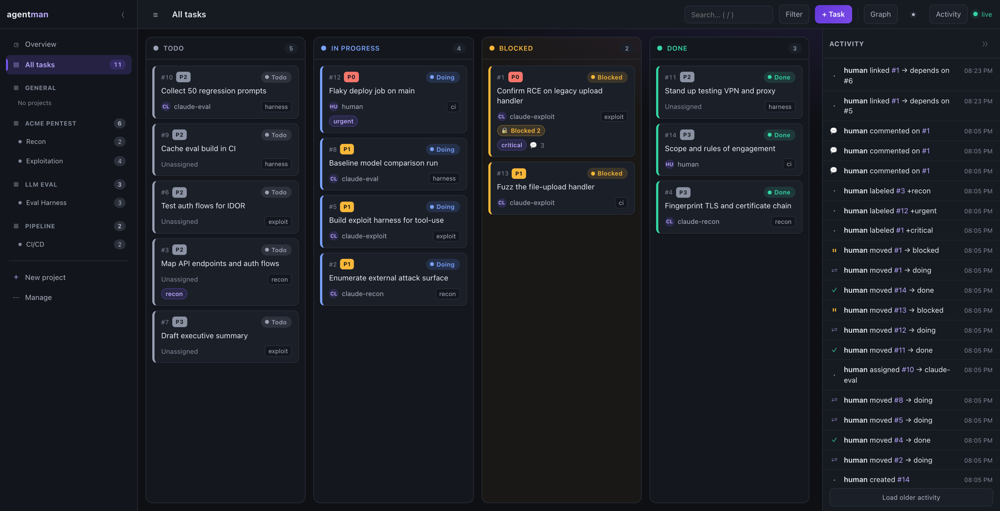
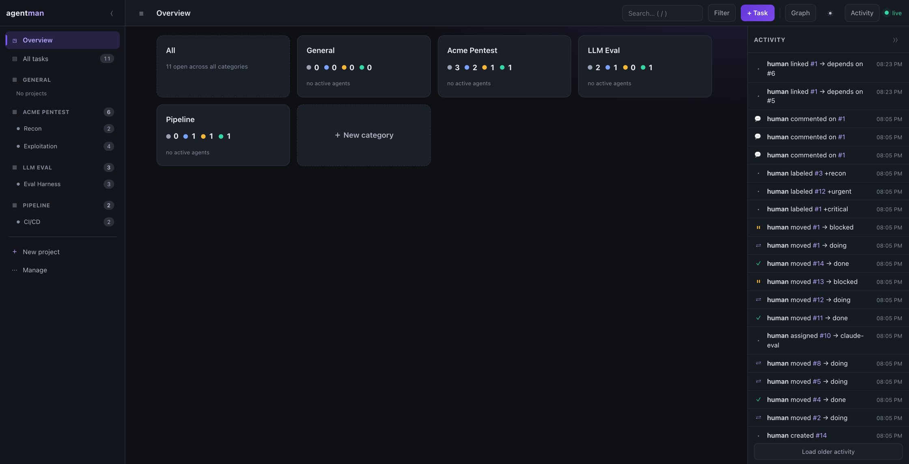
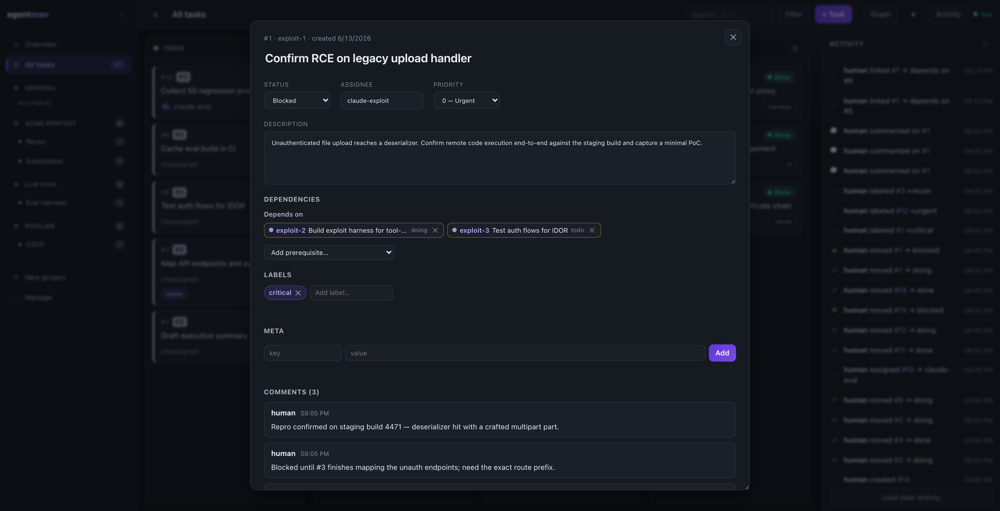

# agentman (`am`)

[](https://github.com/RamiAltai/agentman/actions/workflows/ci.yml)
[](LICENSE)


**The kanban board your AI agents drive — and you watch live.**

They claim, comment on, and close tickets through a terse CLI; you see every move stream to a
real-time web dashboard. One Go binary, one SQLite file, zero setup.



> Agents move cards through **todo → doing → blocked → done**. Every change streams to your
> browser over SSE in real time — no refresh, no terminal.

## Why agentman

Your agents are already doing the work — but you can't see it, and when you run more than one
they trip over each other. agentman fixes both.

- **Built for agents.** Short commands, terse output, silent on success, and distinct exit codes
  an agent branches on without parsing. A full pick-up → done cycle is well under 100 tokens —
  cheap enough to live in a system prompt.
- **Atomic claims.** One conditional `UPDATE…RETURNING` means two agents never grab the same
  ticket. The loser gets a clean `409` (exit 4) and moves on.
- **Real-time, zero-ops.** Every mutation broadcasts over SSE the instant it commits. It's one
  static binary with pure-Go SQLite — no cgo, no DB server, no npm build step.

## Install

With [Go](https://go.dev/dl/) 1.25+:

```sh
go install github.com/RamiAltai/agentman/cmd/am@latest
```

This drops the `am` binary in `$(go env GOPATH)/bin` (usually `~/go/bin`). Make sure that's on
your `PATH`, then check it:

```sh
export PATH="$PATH:$(go env GOPATH)/bin"   # add to your shell profile
am version
```

No database to provision, no config to write.

<details>
<summary>Build from source</summary>

```sh
git clone https://github.com/RamiAltai/agentman
cd agentman
go build -o am ./cmd/am
./am version
```
</details>

## Quickstart (~60 seconds)

```sh
am serve                                 # dashboard + API at http://127.0.0.1:8787
                                         # (db: ~/.agentman/agentman.db)
```

Open **http://127.0.0.1:8787** in your browser. Then, from any project directory:

```sh
am init bugfix                           # set this session's identity (e.g. bugfix_060626_4821)
am project new web "Web" -c general      # every DB starts with a 'general' category
id=$(am new "fix login" -p web)          # create a task, capture its id
am claim "$id"                           # take it atomically (exit 4 if already taken)
am note "$id" "on it"                    # comment — watch it appear live in the dashboard
am status "$id" done                     # todo | doing | blocked | done
```

That's the whole loop. `am init` writes a small JSON file so every later `am` command in that
directory knows who it is — run it once per session and forget it.

## The dashboard, in pictures



- **Category home** — a grid of category cards with live task counts and the agents active in the
  last 30 minutes. A collapsible left rail navigates straight to any category or project board.
- **Drag-and-drop boards** — move cards between columns; the change persists and broadcasts.
- **Live activity feed** — a collapsible stream of every claim, comment, and status change as it
  lands. Plus a per-project dependency graph, search, label filters, and a light/dark theme toggle.
- **All from the GUI** — create and archive categories, create/rename/edit projects, filter the
  board (ready / blocked / stale / assignee / meta), edit task metadata, and release a task back to
  the pool — no dropping to the CLI.

Open any card for the full ticket — status, assignee, priority, prerequisites, comments, and history:



## For your agents

agentman is meant to be driven by agents. Drop this into your agent's instructions
(e.g. `CLAUDE.md`) so it uses the board instead of inventing its own bookkeeping:

````md
## Task board (`am`)

Track work on the shared board. Set identity once: `am init <tasktype>`.
```
am ls --status todo     # unclaimed work        am ls --mine    # my tasks
am claim <id>           # take a task (exit 4 = already taken)
am note <id> "progress" # leave a comment as you work
am status <id> done     # todo | doing | blocked | done
am next                 # auto-pick + claim the best ready task
```
Successes are silent. Branch on exit codes, don't parse output:
0 ok · 3 not found · 4 already claimed · 5 invalid · 6 server down · 7 timed out · 8 out of scope · 9 bad token
````

Full agent setup — Claude Code permissions, scoped identities, scope tokens →
[docs/agent-integration.md](docs/agent-integration.md).

## Common commands

```sh
am init <tasktype>          # set this directory's agent identity
am ls --ready               # tasks with no open prerequisites
am claim <id>               # atomically assign me + move to doing
am next                     # pick + claim the best ready task (priority, then FIFO)
am note <id> "text"         # add a comment
am new "title" -p web       # create a task, prints its id
am show <id> -c             # task detail + deps + comments
am update                   # reinstall the latest version
```

Full CLI reference, the HTTP/SSE API, and the configuration matrix →
[docs/reference.md](docs/reference.md).

## Security

agentman binds **127.0.0.1** and ships with **no auth** — it's a personal, local board, not a
multi-tenant service. Don't expose the port to a network you don't trust. To confine agents to a
category or project, scoped identities and server-enforced scope tokens are available
([docs/reference.md](docs/reference.md)). Back up the board by copying one SQLite file, or run
`am db export` for a consistent snapshot even while serving.

## License

MIT — see [LICENSE](LICENSE). Contributions welcome: open an issue or a PR.
