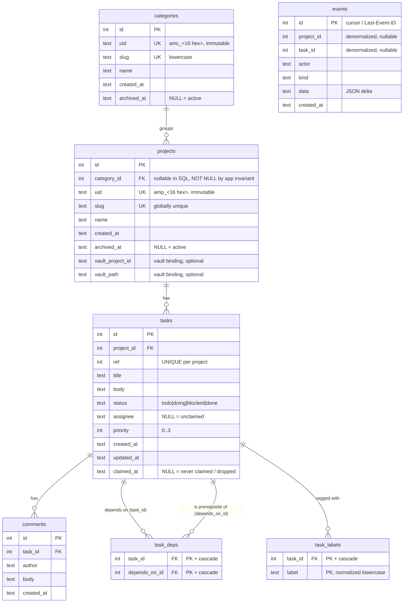

# Data Model

## Overview

Storage is a single **SQLite** database (default `~/.agentman/agentman.db`), WAL mode, owned by
one writer process. Schema is in `cmd/am/schema.sql` (embedded and executed at startup by
`store.OpenStore`). Eight tables: `meta`, `categories`, `projects`, `tasks`, `task_deps`,
`task_labels`, `comments`, `events`.
All timestamps are ISO-8601 UTC **TEXT** (`strftime('%Y-%m-%dT%H:%M:%fZ','now')`), so they sort
lexically.

## Entities

| Entity | Purpose | Source |
|--------|---------|--------|
| `meta` | Key/value config; currently only `schema_version` (the binary migrates to `'4'`) | `schema.sql` |
| `categories` | The layer above projects (`instance → category → project → task`): `uid` stable id, `slug` unique lowercase, `name`, `archived_at` | `schema.sql`, `store.go Category` |
| `projects` | Named boards (`slug` unique, `name`, `archived_at`, `category_id`, `uid` stable id, `vault_project_id`/`vault_path` binding) | `schema.sql` + migration v4, `store.go Project` |
| `tasks` | Tickets (status, priority, assignee, dual id) | `schema.sql`, `store.go Task` |
| `task_deps` | Prerequisite edges between tasks (many-to-many, same-project only) | `schema.sql`, `store.go DepRef` |
| `task_labels` | Free-form tags on tasks (many-to-many, label text stored inline — no catalog) | `schema.sql`, `store.go Task.Labels` |
| `comments` | Threaded notes on a task | `schema.sql`, `store.go Comment` |
| `events` | Append-only mutation log = activity feed + SSE backbone + cursor | `schema.sql`, `store.go Event` |

### Important fields

- **`tasks.id`** — global autoincrement; the cheap wire reference (`#42`). **`tasks.ref`** —
  per-project sequence (`web-3`), allocated as `MAX(ref)+1` within the project in the insert tx
  (`store.go CreateTask`); `UNIQUE(project_id, ref)`.
- **`tasks.status`** — `CHECK (status IN ('todo','doing','blocked','done'))`, default `todo`.
- **`tasks.priority`** — INTEGER, `0=urgent … 3=low`, default `2`.
- **`tasks.assignee`** — TEXT, **NULL = unclaimed** (the claim guard depends on this).
- **`tasks.claimed_at`** — TEXT, **NULL = never claimed / dropped**; set by `ClaimTask`,
  `StealStaleClaim`, `NextTask`, and PATCH-assign; cleared when the assignee is removed (`am drop`).
  Added by schema **migration v3** (`ALTER TABLE tasks ADD COLUMN claimed_at TEXT` — not in
  `schema.sql`, same precedent as `projects.archived_at`). Staleness itself is judged from
  `updated_at` (any activity counts), not `claimed_at`; the stale cutoff is computed in Go by
  `staleCutoff`, which must keep the exact `strftime('%Y-%m-%dT%H:%M:%fZ')` 3-digit-fraction
  format for the lexicographic comparison to hold.
- **`task_deps.(task_id, depends_on_id)`** — composite PK on the pair. Both columns are FKs to
  `tasks.id` with `ON DELETE CASCADE`, so removing a task automatically removes all edges in both
  directions. A reverse index `idx_task_deps_prereq(depends_on_id)` supports the "blocks" query.
  Dependencies are **same-project only** (validated in `AddDep`; cross-project attempt → 400).
  Cycle detection uses a recursive CTE (`wouldCycle`) so transitive cycles are caught. The table is
  added via `CREATE TABLE IF NOT EXISTS` in `schema.sql`, which runs on every `OpenStore` — so it
  propagates to existing DBs **without a migration-runner step and without bumping
  `currentSchemaVersion`** (no `ALTER` is needed; a new table just needs to be present in
  `schema.sql`).
- **`task_labels.(task_id, label)`** — composite PK; `task_id` is an FK to `tasks.id` with
  `ON DELETE CASCADE`. The label TEXT is stored inline (no separate labels catalog — a label
  exists iff some task carries it). Labels are normalized at the boundary (`normalizeLabel`):
  trimmed, lowercased, 1–50 bytes of `a-z 0-9 . _ -` (charset excludes `,` for safe
  `GROUP_CONCAT` splitting and `+`/space for unambiguous CLI tokens). Adding/removing a label
  does **not** bump the task's `updated_at` (metadata must not refresh a stale claim). Filterable
  via `GET /api/tasks?label=<l>` (`TaskFilter.Label`); free-text search is the separate
  `?q=<text>` (`TaskFilter.Query`) — a LIKE-with-ESCAPE substring match on title OR body,
  ASCII-case-insensitive, which does **not** search labels or comments. Like `task_deps`, the
  table is added via `CREATE TABLE IF NOT EXISTS` in `schema.sql` — no migration-runner step, no
  version bump (ADR-024).
- **`projects.archived_at`** — TEXT, **NULL = active**; an ISO-8601 UTC timestamp set when the
  project is archived (`store.go ArchiveProject`) and cleared back to NULL on unarchive
  (`UnarchiveProject`). Soft-archive is reversible; default project lists hide archived rows.
- **`categories.uid` / `projects.uid`** — the **stable IDs** (`amc_<16 hex>` / `amp_<16 hex>`,
  8 bytes of `crypto/rand` via `newUID`). Immutable after creation, survive slug renames — the
  vault's canonical correlation key (R2). `categories.uid` is `TEXT NOT NULL UNIQUE` in
  `schema.sql`; `projects.uid` is added by migration v4 with a separate unique index
  (`idx_projects_uid` — `UNIQUE` isn't allowed in `ADD COLUMN`). Insert paths retry on the
  astronomically unlikely UNIQUE collision (`isUniqueErr`).
- **`projects.category_id`** — `INTEGER REFERENCES categories(id)`, **nullable in SQL but NOT
  NULL by app invariant**: SQLite's `ALTER TABLE ADD COLUMN` cannot add a NOT NULL column without
  a constant default (wrong for an FK), so `CreateProject` always sets it, migration v4 backfills
  all NULLs to the `general` category, and nothing can clear it (`category_id` is not patchable).
  Project slugs remain **globally unique** (no per-category namespacing), so task refs like
  `web-3` and `AGENTMAN_PROJECT` are unambiguous without a category.
- **`projects.vault_project_id` / `projects.vault_path`** — optional TEXT vault-binding pointers
  (R3): the vault's stable project ID (canonical) and an informational local path. Settable via
  `PATCH /api/projects/{slug}` / `am project edit --vault-id/--vault-path`; an explicit empty
  string clears them (stored as NULL). agentman stores the binding; the vault owns its meaning.
- **`categories.archived_at`** — TEXT, **NULL = active**; same soft-archive semantics as
  projects, with a **cascade**: default views hide projects/tasks/events under an archived
  category, `next` never picks from one, and task/project creation into one is rejected
  (`ErrCategoryArchived`). An explicit `?category=` scope keeps an archived category inspectable.
- **`events.id`** — monotonic; doubles as the `?since=` cursor and the SSE `Last-Event-ID`.
- **`events.kind`** — one of `task.created | task.claimed | task.reclaimed | task.status |
  task.assign | task.patched | task.deleted | task.dep_added | task.dep_removed | task.labeled |
  task.unlabeled | comment.added | comment.deleted | project.created | project.archived |
  project.unarchived | project.patched | project.deleted | category.created | category.archived |
  category.unarchived` (21 total). `task.reclaimed` is emitted by a stale-claim
  takeover and its data names the previous assignee and the `stale_for` window;
  `task.labeled`/`task.unlabeled` carry `{"label": l}`; `project.patched` carries a compact
  delta like task patches (e.g. `{"slug":["old","new"]}`); the `category.*` kinds carry `{slug}`
  and have a **NULL `project_id`** (they reach unscoped SSE subscribers only — project-scoped
  subscribers filter on project id; Phase R revisits).
- **`events.data`** — compact JSON delta, e.g. `{"status":["todo","doing"]}`.

### Indexes

`idx_tasks_project_status(project_id,status)`, `idx_tasks_assignee(assignee)`,
`idx_tasks_updated(updated_at)`, `idx_task_deps_prereq(depends_on_id)`,
`idx_task_labels_label(label)`, `idx_comments_task(task_id,id)`, `idx_events_since(id)`,
`idx_projects_uid(uid)` (UNIQUE), `idx_projects_category(category_id)`.

## Relationships

- `projects.category_id → categories.id` — plain FK (no cascade; nullable in SQL, NOT NULL by
  app invariant — see Important fields).
- `tasks.project_id → projects.id` — `ON DELETE CASCADE`.
- `task_deps.task_id → tasks.id` — `ON DELETE CASCADE`.
- `task_deps.depends_on_id → tasks.id` — `ON DELETE CASCADE`.
- `task_labels.task_id → tasks.id` — `ON DELETE CASCADE`.
- `comments.task_id → tasks.id` — `ON DELETE CASCADE`.
- `events.project_id` / `events.task_id` — **denormalized, nullable, NOT foreign keys** (so events
  survive even if the referenced row is gone; e.g. `project.created` has no task). Confirmed:
  `schema.sql` defines no FK on `events`.

Ownership: a category groups projects (no delete cascade — categories are only soft-archived);
a project owns its tasks; a task owns its comments, its labels, and its dependency
edges (both directions cascade). Cascade deletes flow project → tasks → comments; deleting a task
also removes its `task_labels` rows and all `task_deps` rows where it is either the dependent or
the prerequisite. **Events are never deleted** (append-only).

## Sensitive Data

- **No credentials, secrets, tokens, or PII schema.** There is no user/account table.
- Free-text fields (`tasks.title`, `tasks.body`, `comments.body`) and `assignee`/`actor` are
  **agent-supplied and untrusted** — they may contain whatever agents write (internal plans, repo
  names, possibly secrets pasted by an agent). They are rendered XSS-safely on the dashboard
  (`web/app.js` uses `textContent`, never `innerHTML`). See `security.md`.

## Data Lifecycle

- **Create:** categories/projects/tasks/comments via API; each mutation also appends one `events` row in the
  same transaction. Dependency edges are created via `POST /api/tasks/{id}/deps` (`AddDep`), which
  validates same-project + no-cycle and emits a `task.dep_added` event. Removing an edge uses
  `DELETE /api/tasks/{id}/deps/{depId}` (`RemoveDep`), emitting `task.dep_removed`. Edges cascade
  on task delete (both directions). Labels are attached via `POST /api/tasks/{id}/labels`
  (`AddLabel`, emits `task.labeled`) and removed via `DELETE /api/tasks/{id}/labels/{label}`
  (`RemoveLabel`, emits `task.unlabeled`); both are idempotent (no-op commits without an event)
  and neither bumps the task's `updated_at`.
- **Update:** `tasks` (status/assignee/title/body/priority, plus `claimed_at` kept in step
  with the assignee — set on claim/steal/assign, NULLed on unassign); `updated_at` set explicitly
  in each `UPDATE` (no trigger). Projects are also patchable since Phase O (`PatchProject`:
  slug/name/`vault_project_id`/`vault_path`; `uid` and `category_id` never — one
  `project.patched` event per non-empty patch).
- **Archive (soft, projects and categories):** a project can be **soft-archived** —
  `ArchiveProject` sets `projects.archived_at` (and `UnarchiveProject` clears it). This is
  **reversible** and hides the project from default lists; it is **not** a hard delete (the row
  and its tasks/comments stay). Archiving is enforced across three surfaces:
  - **Tasks** — `ListTasks` adds `p.archived_at IS NULL` (JOIN on projects) when no project
    filter is given; an explicit `?project=<slug>` still returns that archived project's tasks.
  - **Activity feed** — `ListEvents` and `RecentEvents` similarly LEFT JOIN projects and exclude
    events whose project is archived (`p.archived_at IS NULL`) when no `project=` filter is
    present; an explicit `?project=<slug>` still returns that project's events. The SSE replay
    path (`handleStream` → `ListEvents`) inherits this filter automatically.
  - **Task creation** — `CreateTask` checks the target project's `archived_at` before the insert
    transaction; if the project is archived it returns the sentinel `ErrProjectArchived`, mapped
    to HTTP 400 `{"error":"project_archived"}` by `writeErr`. The CLI prints `project_archived`
    to stderr and exits non-zero.

  Categories archive the same way (`ArchiveCategory`/`UnarchiveCategory`, idempotent, no event
  on a no-op) with a **cascade** over the same three surfaces: the unscoped project list, task
  list, and event feed all also require `c.archived_at IS NULL`; an explicit `?category=` scope
  drops the category-archived condition (the archived category stays inspectable, mirroring the
  explicit-project rule); `NextTask` excludes archived categories **unconditionally**; and task
  *or project* creation under an archived category returns `ErrCategoryArchived` → HTTP 400
  `{"error":"category_archived"}` (CLI exit 5).
- **Delete (hard, irreversible):** `DELETE /api/tasks/{id}`, `DELETE /api/tasks/{id}/comments/{cid}`,
  and `DELETE /api/projects/{slug}` — backed by `store.DeleteTask`, `store.DeleteComment`, and
  `store.DeleteProject` respectively — permanently remove rows. Each method inserts the matching
  `*.deleted` event in the **same transaction** before the `DELETE`, then commits; the handler
  broadcasts after commit. Cascade is via existing schema FKs (`projects → tasks → comments`
  and `tasks → comments` are `ON DELETE CASCADE`; DSN has `foreign_keys(1)`), so deleting a project
  removes all its tasks and comments, and deleting a task removes all its comments.
  **`events` rows are not deleted by hard-delete operations** — `events.project_id` / `events.task_id` are denormalized,
  nullable, and not foreign keys (confirmed: `schema.sql` defines no FK on `events`), so the
  audit log, including the new `*.deleted` event, survives the hard delete.
  **Nuance — deleted-project events reappear in the feed:** the unfiltered activity feed uses
  `LEFT JOIN projects p ON p.id = events.project_id … (events.project_id IS NULL OR p.archived_at IS NULL)`.
  A deleted project has no row, so the JOIN yields NULL, which the `archived_at IS NULL` check
  passes — making the deleted project's earlier event history visible in the feed (acceptable as an
  audit trail; this differs from a *soft-archived* project whose events are hidden while the row exists).
  **`ref` reuse:** the global `tasks.id` autoincrement never reuses (wire references stay stable),
  but a per-project human `ref` (e.g. `web-3`) can be reused if the highest-numbered task in a
  project is deleted and a new task is then created (no counter/migration was added — acceptable
  for a personal board).
  CLI: `am rm <id>` (silent success; exit 3 if not found); `am project rm <slug> --yes` (requires
  `--yes` or it errors with a hint; cascade-deletes the project and all its tasks/comments).
  Missing target → `ErrNotFound` → HTTP 404.
- **Growth:** `events` can now be **paged** (`GET /api/events?before=<id>` — backward cursor via
  `ListEventsBefore`) and **pruned** offline with `am db prune (--before <YYYY-MM-DD> | --keep <N>)`
  (events-only, no HTTP route, refuses while a server is running). `comments` are still only removed
  individually via the hard-delete endpoint (Phase C1). The dashboard caps the "Done" column render at
  50 and the feed at ~200 nodes (`web/app.js`), but the DB retains everything until explicitly pruned.

## Migrations

**A forward-only migration runner exists (Phase 0, ADR-010).** `OpenStore` executes `schema.sql`
(`CREATE TABLE IF NOT EXISTS` + `INSERT OR IGNORE … schema_version`) and then calls
`runMigrations(db, currentSchemaVersion, schemaMigrations)`. Each step applies its change **and**
bumps `meta.schema_version` in one transaction; steps are integer-ordered and idempotent.

To add a column/table change, append a `{version, apply}` step to `schemaMigrations` and raise
`currentSchemaVersion` (`cmd/am/store.go`, now `4`). `schemaMigrations` is **no longer empty**: its
first real step is `{version: 2}`, which runs `ALTER TABLE projects ADD COLUMN archived_at TEXT`;
Phase K added `{version: 3}`, which runs `ALTER TABLE tasks ADD COLUMN claimed_at TEXT`; and
Phase O added `{version: 4}` — the category/stable-ID/vault-binding migration: it adds
`projects.category_id`, `projects.uid` (+ unique index), `projects.vault_project_id`,
`projects.vault_path`, and `idx_projects_category`; seeds the default category `general`
**unconditionally** (fresh installs get it too); attaches every existing project to it; and
backfills a distinct `amp_` uid per project (task ids/refs/`claimed_at`/labels untouched). The
`categories` table itself ships in `schema.sql` (`CREATE TABLE IF NOT EXISTS` runs before
migrations on both fresh and existing DBs); the projects `CREATE TABLE` in `schema.sql` stays the
**frozen v1 baseline** — the new columns come only from the v4 step.
`schema.sql` still seeds a fresh DB at version 1, so the forward-only runner is **exercised
end-to-end** — each step applies its change and commits the `meta.schema_version` bump in the same
transaction (was foundation-only in Phase 0). Known limitations: forward-only (no down-migrations);
an unparseable `schema_version` defaults to 1. A DB at a **newer** version than the binary is no
longer accepted silently: `OpenStore` refuses it with `database schema_version N is newer than
supported M — upgrade am` (Phase O), the same ceiling `validateImportCandidate` applies to
import snapshots.

**New tables via `schema.sql` (no migration-runner step, no version bump):** when a change adds an
entirely new table (rather than altering an existing one), placing a `CREATE TABLE IF NOT EXISTS`
in `schema.sql` is sufficient — `OpenStore` runs `schema.sql` on every start, so the new table
appears in existing DBs automatically. The migration runner is only needed for `ALTER TABLE` on
existing tables (where `IF NOT EXISTS` can't help). Examples: `task_deps` (Phase H) and
`task_labels` (Phase M, ADR-024) were both added this way, with no `schemaMigrations` step and
no `currentSchemaVersion` bump.

Backup/restore:

- **File-copy:** copy `agentman.db` (+ `-wal`/`-shm`) while the server is stopped (`README.md`).
- **`am db export [path]`** — writes a consistent snapshot via SQLite `VACUUM INTO`, `chmod 0o600`,
  and prints the output path (`cmd/am/db.go exportDB`).
- **`am db import <path>`** — validates the candidate (PRAGMA `integrity_check`, `foreign_key_check`,
  required tables, `schema_version <= currentSchemaVersion`), **refuses while a server is running**,
  backs up the current DB (`0o600`) into the DB's directory, then atomically replaces it
  (`cmd/am/db.go importDB`). The required-table set is **deliberately the v1 baseline** (no
  `categories`/`task_deps`/`task_labels`) — later tables are created by `schema.sql`/migrations on
  the next `OpenStore`, so pre-v4 snapshots stay importable and migrate on open. Export needs no
  special handling for new tables (`VACUUM INTO` snapshots everything, categories included).
- **`am db prune (--before <YYYY-MM-DD> | --keep <N>) [--db PATH] [--yes]`** — offline maintenance
  (refuses while a server is running, like `am db import`); deletes rows from the **`events` table
  only** (NOT comments/tasks/projects), then runs `VACUUM` (best-effort) to reclaim disk space.
  Prints `pruned N events` to stderr; stdout stays clean. `--before <date>`: deletes events strictly
  before that calendar day (same-day events are kept — a date-only string sorts before same-day ISO
  timestamps). `--keep N`: keeps the newest N events by id, deletes the rest. Confirms unless `--yes`.

## Diagram

(`events` is intentionally not FK-linked; shown dashed-conceptually only.)

## Unknowns

- **Retention policy for `comments`** — none defined; comments are only removed individually via
  hard-delete. For `events`: offline pruning is available via `am db prune` (see Backup/restore).
- **Per-project `ref` is not gap-free after deletes** — `MAX(ref)+1` reuses the number if the
  highest-numbered task in a project is deleted and a new task is created. Accepted for a personal
  board (no counter/migration added, Phase C1 decision).
