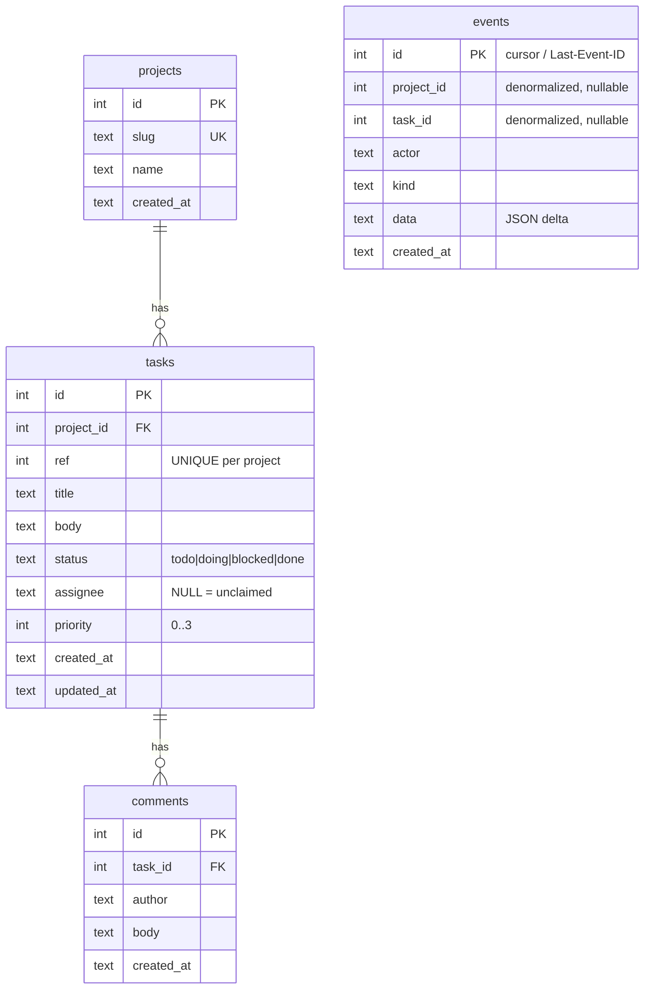

# Data Model

## Overview

Storage is a single **SQLite** database (default `~/.agentman/agentman.db`), WAL mode, owned by
one writer process. Schema is in `cmd/am/schema.sql` (embedded and executed at startup by
`store.OpenStore`). Five tables: `meta`, `projects`, `tasks`, `comments`, `events`. All timestamps
are ISO-8601 UTC **TEXT** (`strftime('%Y-%m-%dT%H:%M:%fZ','now')`), so they sort lexically.

## Entities

| Entity | Purpose | Source |
|--------|---------|--------|
| `meta` | Key/value config; currently only `schema_version='1'` | `schema.sql` |
| `projects` | Named boards (`slug` unique, `name`) | `schema.sql`, `store.go Project` |
| `tasks` | Tickets (status, priority, assignee, dual id) | `schema.sql`, `store.go Task` |
| `comments` | Threaded notes on a task | `schema.sql`, `store.go Comment` |
| `events` | Append-only mutation log = activity feed + SSE backbone + cursor | `schema.sql`, `store.go Event` |

### Important fields

- **`tasks.id`** — global autoincrement; the cheap wire reference (`#42`). **`tasks.ref`** —
  per-project sequence (`web-3`), allocated as `MAX(ref)+1` within the project in the insert tx
  (`store.go CreateTask`); `UNIQUE(project_id, ref)`.
- **`tasks.status`** — `CHECK (status IN ('todo','doing','blocked','done'))`, default `todo`.
- **`tasks.priority`** — INTEGER, `0=urgent … 3=low`, default `2`.
- **`tasks.assignee`** — TEXT, **NULL = unclaimed** (the claim guard depends on this).
- **`events.id`** — monotonic; doubles as the `?since=` cursor and the SSE `Last-Event-ID`.
- **`events.kind`** — one of `task.created | task.claimed | task.status | task.assign |
  task.patched | comment.added | project.created`.
- **`events.data`** — compact JSON delta, e.g. `{"status":["todo","doing"]}`.

### Indexes

`idx_tasks_project_status(project_id,status)`, `idx_tasks_assignee(assignee)`,
`idx_tasks_updated(updated_at)`, `idx_comments_task(task_id,id)`, `idx_events_since(id)`.

## Relationships

- `tasks.project_id → projects.id` — `ON DELETE CASCADE`.
- `comments.task_id → tasks.id` — `ON DELETE CASCADE`.
- `events.project_id` / `events.task_id` — **denormalized, nullable, NOT foreign keys** (so events
  survive even if the referenced row is gone; e.g. `project.created` has no task). Confirmed:
  `schema.sql` defines no FK on `events`.

Ownership: a project owns its tasks; a task owns its comments. Cascade deletes flow
project → tasks → comments. **Events are never deleted** (append-only).

## Sensitive Data

- **No credentials, secrets, tokens, or PII schema.** There is no user/account table.
- Free-text fields (`tasks.title`, `tasks.body`, `comments.body`) and `assignee`/`actor` are
  **agent-supplied and untrusted** — they may contain whatever agents write (internal plans, repo
  names, possibly secrets pasted by an agent). They are rendered XSS-safely on the dashboard
  (`web/app.js` uses `textContent`, never `innerHTML`). See `security.md`.

## Data Lifecycle

- **Create:** projects/tasks/comments via API; each mutation also appends one `events` row in the
  same transaction.
- **Update:** `tasks` only (status/assignee/title/body/priority); `updated_at` set explicitly in
  each `UPDATE` (no trigger).
- **Delete:** **No delete endpoint or store method exists** for projects/tasks/comments today —
  the cascade rules are defined but unused via the API (Confirmed: no `DELETE` route in
  `server.go`). Removal only happens by editing the DB file directly.
- **Growth:** `events` and `comments` grow unbounded; the dashboard caps the "Done" column render
  at 50 and the feed at ~200 nodes (`web/app.js`), but the DB retains everything.

## Migrations

**A forward-only migration runner exists (Phase 0, ADR-010).** `OpenStore` executes `schema.sql`
(`CREATE TABLE IF NOT EXISTS` + `INSERT OR IGNORE … schema_version`) and then calls
`runMigrations(db, currentSchemaVersion, schemaMigrations)`. Each step applies its change **and**
bumps `meta.schema_version` in one transaction; steps are integer-ordered and idempotent.

To add a column/table change, append a `{version, apply}` step to `schemaMigrations` and raise
`currentSchemaVersion` (`cmd/am/store.go`). `schemaMigrations` is **currently empty** (no schema
change has shipped yet; Phase 2 will add `projects.archived_at` as the first real step). Known
limitations: forward-only (no down-migrations); a DB at a **newer** version than the binary is
accepted silently today; an unparseable `schema_version` defaults to 1. Backup/restore is still
file-copy (`README.md`).

Backup/restore is file-copy: copy `agentman.db` (+ `-wal`/`-shm`) while the server is stopped
(`README.md`).

## Diagram

(`events` is intentionally not FK-linked; shown dashed-conceptually only.)

## Unknowns

- **Retention/archival policy** for `events`/`comments` — none defined (Unknown).
- Whether per-project `ref` is expected to stay gap-free after deletes — moot today (no deletes),
  but `MAX(ref)+1` would reuse numbers if deletes were added (Inference, Confidence: Medium).
