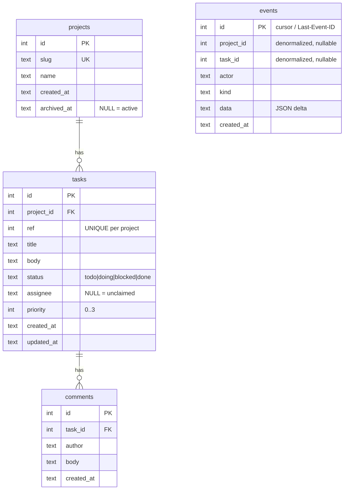

# Data Model

## Overview

Storage is a single **SQLite** database (default `~/.agentman/agentman.db`), WAL mode, owned by
one writer process. Schema is in `cmd/am/schema.sql` (embedded and executed at startup by
`store.OpenStore`). Five tables: `meta`, `projects`, `tasks`, `comments`, `events`. All timestamps
are ISO-8601 UTC **TEXT** (`strftime('%Y-%m-%dT%H:%M:%fZ','now')`), so they sort lexically.

## Entities

| Entity | Purpose | Source |
|--------|---------|--------|
| `meta` | Key/value config; currently only `schema_version` (the binary migrates to `'2'`) | `schema.sql` |
| `projects` | Named boards (`slug` unique, `name`, `archived_at`) | `schema.sql`, `store.go Project` |
| `tasks` | Tickets (status, priority, assignee, dual id) | `schema.sql`, `store.go Task` |
| `comments` | Threaded notes on a task | `schema.sql`, `store.go Comment` |
| `events` | Append-only mutation log = activity feed + SSE backbone + cursor | `schema.sql`, `store.go Event` |

### Important fields

- **`tasks.id`** — global autoincrement; the cheap wire reference (`#42`). **`tasks.ref`** —
  per-project sequence (`web-3`), allocated as `MAX(ref)+1` within the project in the insert tx
  (`store.go CreateTask`); `UNIQUE(project_id, ref)`.
- **`tasks.status`** — `CHECK (status IN ('todo','doing','blocked','done'))`, default `todo`.
- **`tasks.priority`** — INTEGER, `0=urgent … 3=low`, default `2`.
- **`tasks.assignee`** — TEXT, **NULL = unclaimed** (the claim guard depends on this).
- **`projects.archived_at`** — TEXT, **NULL = active**; an ISO-8601 UTC timestamp set when the
  project is archived (`store.go ArchiveProject`) and cleared back to NULL on unarchive
  (`UnarchiveProject`). Soft-archive is reversible; default project lists hide archived rows.
- **`events.id`** — monotonic; doubles as the `?since=` cursor and the SSE `Last-Event-ID`.
- **`events.kind`** — one of `task.created | task.claimed | task.status | task.assign |
  task.patched | task.deleted | comment.added | comment.deleted | project.created |
  project.archived | project.unarchived | project.deleted` (12 total).
- **`events.data`** — compact JSON delta, e.g. `{"status":["todo","doing"]}`.

### Indexes

`idx_tasks_project_status(project_id,status)`, `idx_tasks_assignee(assignee)`,
`idx_tasks_updated(updated_at)`, `idx_comments_task(task_id,id)`, `idx_events_since(id)`.

## Relationships

- `tasks.project_id → projects.id` — `ON DELETE CASCADE`.
- `comments.task_id → tasks.id` — `ON DELETE CASCADE`.
- `events.project_id` / `events.task_id` — **denormalized, nullable, NOT foreign keys** (so events
  survive even if the referenced row is gone; e.g. `project.created` has no task). Confirmed:
  `schema.sql` defines no FK on `events`.

Ownership: a project owns its tasks; a task owns its comments. Cascade deletes flow
project → tasks → comments. **Events are never deleted** (append-only).

## Sensitive Data

- **No credentials, secrets, tokens, or PII schema.** There is no user/account table.
- Free-text fields (`tasks.title`, `tasks.body`, `comments.body`) and `assignee`/`actor` are
  **agent-supplied and untrusted** — they may contain whatever agents write (internal plans, repo
  names, possibly secrets pasted by an agent). They are rendered XSS-safely on the dashboard
  (`web/app.js` uses `textContent`, never `innerHTML`). See `security.md`.

## Data Lifecycle

- **Create:** projects/tasks/comments via API; each mutation also appends one `events` row in the
  same transaction.
- **Update:** `tasks` only (status/assignee/title/body/priority); `updated_at` set explicitly in
  each `UPDATE` (no trigger).
- **Archive (soft, projects only):** a project can be **soft-archived** — `ArchiveProject` sets
  `projects.archived_at` (and `UnarchiveProject` clears it). This is **reversible** and hides the
  project from default lists; it is **not** a hard delete (the row and its tasks/comments stay).
  Archiving is now enforced across three surfaces:
  - **Tasks** — `ListTasks` adds `p.archived_at IS NULL` (LEFT JOIN on projects) when no project
    filter is given; an explicit `?project=<slug>` still returns that archived project's tasks.
  - **Activity feed** — `ListEvents` and `RecentEvents` similarly LEFT JOIN projects and exclude
    events whose project is archived (`p.archived_at IS NULL`) when no `project=` filter is
    present; an explicit `?project=<slug>` still returns that project's events. The SSE replay
    path (`handleStream` → `ListEvents`) inherits this filter automatically.
  - **Task creation** — `CreateTask` checks the target project's `archived_at` before the insert
    transaction; if the project is archived it returns the sentinel `ErrProjectArchived`, mapped
    to HTTP 400 `{"error":"project_archived"}` by `writeErr`. The CLI prints `project_archived`
    to stderr and exits non-zero.
- **Delete (hard, irreversible):** `DELETE /api/tasks/{id}`, `DELETE /api/tasks/{id}/comments/{cid}`,
  and `DELETE /api/projects/{slug}` — backed by `store.DeleteTask`, `store.DeleteComment`, and
  `store.DeleteProject` respectively — permanently remove rows. Each method inserts the matching
  `*.deleted` event in the **same transaction** before the `DELETE`, then commits; the handler
  broadcasts after commit. Cascade is via existing schema FKs (`projects → tasks → comments`
  and `tasks → comments` are `ON DELETE CASCADE`; DSN has `foreign_keys(1)`), so deleting a project
  removes all its tasks and comments, and deleting a task removes all its comments.
  **`events` rows are never deleted** — `events.project_id` / `events.task_id` are denormalized,
  nullable, and not foreign keys (confirmed: `schema.sql` defines no FK on `events`), so the
  audit log, including the new `*.deleted` event, survives the hard delete.
  **Nuance — deleted-project events reappear in the feed:** the unfiltered activity feed uses
  `LEFT JOIN projects p ON p.id = events.project_id … (events.project_id IS NULL OR p.archived_at IS NULL)`.
  A deleted project has no row, so the JOIN yields NULL, which the `archived_at IS NULL` check
  passes — making the deleted project's earlier event history visible in the feed (acceptable as an
  audit trail; this differs from a *soft-archived* project whose events are hidden while the row exists).
  **`ref` reuse:** the global `tasks.id` autoincrement never reuses (wire references stay stable),
  but a per-project human `ref` (e.g. `web-3`) can be reused if the highest-numbered task in a
  project is deleted and a new task is then created (no counter/migration was added — acceptable
  for a personal board).
  CLI: `am rm <id>` (silent success; exit 3 if not found); `am project rm <slug> --yes` (requires
  `--yes` or it errors with a hint; cascade-deletes the project and all its tasks/comments).
  Missing target → `ErrNotFound` → HTTP 404.
- **Growth:** `events` and `comments` grow unbounded (C2 pending); the dashboard caps the "Done"
  column render at 50 and the feed at ~200 nodes (`web/app.js`), but the DB retains everything.

## Migrations

**A forward-only migration runner exists (Phase 0, ADR-010).** `OpenStore` executes `schema.sql`
(`CREATE TABLE IF NOT EXISTS` + `INSERT OR IGNORE … schema_version`) and then calls
`runMigrations(db, currentSchemaVersion, schemaMigrations)`. Each step applies its change **and**
bumps `meta.schema_version` in one transaction; steps are integer-ordered and idempotent.

To add a column/table change, append a `{version, apply}` step to `schemaMigrations` and raise
`currentSchemaVersion` (`cmd/am/store.go`, now `2`). `schemaMigrations` is **no longer empty**: its
first real step is `{version: 2}`, which runs `ALTER TABLE projects ADD COLUMN archived_at TEXT`.
`schema.sql` still seeds a fresh DB at version 1, so the forward-only runner is now **exercised
end-to-end** — each step applies its change and commits the `meta.schema_version` bump in the same
transaction (was foundation-only in Phase 0). Known limitations: forward-only (no down-migrations);
a DB at a **newer** version than the binary is accepted silently today; an unparseable
`schema_version` defaults to 1.

Backup/restore:

- **File-copy:** copy `agentman.db` (+ `-wal`/`-shm`) while the server is stopped (`README.md`).
- **`am db export [path]`** — writes a consistent snapshot via SQLite `VACUUM INTO`, `chmod 0o600`,
  and prints the output path (`cmd/am/db.go exportDB`).
- **`am db import <path>`** — validates the candidate (PRAGMA `integrity_check`, `foreign_key_check`,
  required tables, `schema_version <= currentSchemaVersion`), **refuses while a server is running**,
  backs up the current DB (`0o600`) into the DB's directory, then atomically replaces it
  (`cmd/am/db.go importDB`).

## Diagram

(`events` is intentionally not FK-linked; shown dashed-conceptually only.)

## Unknowns

- **Retention/archival policy** for `events`/`comments` — none defined (C2 pending, Unknown).
- **Per-project `ref` is not gap-free after deletes** — `MAX(ref)+1` reuses the number if the
  highest-numbered task in a project is deleted and a new task is created. Accepted for a personal
  board (no counter/migration added, Phase C1 decision).
