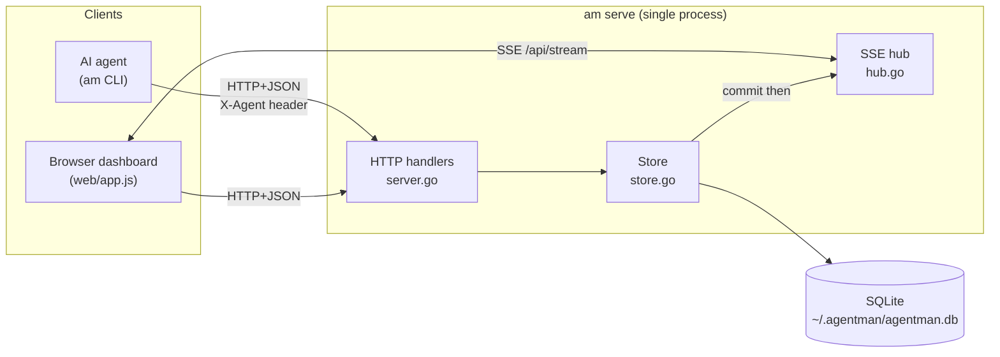

# System Map

## High-Level Architecture

One Go binary, two roles selected by the first CLI argument:

- **`am serve`** → an HTTP server (net/http) that owns the SQLite database, serves a JSON API,
  streams Server-Sent Events, and serves an embedded web dashboard.
- **Any other verb** (`ls`, `claim`, `note`, …) → a thin HTTP **client** of that same API.

Data flow: **CLI/dashboard → HTTP+JSON API → SQLite (single writer) → `events` table → SSE
broadcast → dashboard**. Confirmed via `cmd/am/main.go`, `cmd/am/server.go`, `cmd/am/store.go`,
`cmd/am/hub.go`.

## Directory Map

| Path | Purpose | Notes |
|------|---------|-------|
| `cmd/am/` | The entire `main` package (server + CLI) | Flat package; ~10 `.go` files |
| `cmd/am/main.go` | Entry point; subcommand dispatch; `runServe` | `main()` + `runServe()` + `usage()` |
| `cmd/am/server.go` | HTTP handlers, routing, SSE endpoint, `go:embed web` | `Server`, `Handler()`, `handle*` |
| `cmd/am/hub.go` | SSE subscriber hub (broadcast/fan-out) | `Hub`, `subscriber` |
| `cmd/am/store.go` | All SQLite access; types; atomic claim; events | `Store` + domain structs |
| `cmd/am/schema.sql` | DB schema (embedded) | `meta/projects/tasks/comments/events` |
| `cmd/am/client.go` | CLI HTTP client; HTTP-status → exit-code mapping | `Client`, `doOrFail` |
| `cmd/am/cli.go` | CLI verb parsing + terse/JSON formatters | `cmd*`, `parse`, `fail` |
| `cmd/am/identity.go` | Per-directory agent identity (`am init`/`am whoami`) | `resolveAgent`, `identityFile` |
| `cmd/am/version.go` | Version reporting (`am version`) | `version()`, `injectedVersion` (ldflags) |
| `cmd/am/update.go` | `am update` + startup update check | `cmdUpdate`, `checkForUpdate` |
| `cmd/am/update_test.go` | The only tests (version-comparison logic) | 3 tests |
| `cmd/am/web/` | Embedded dashboard: `index.html`, `app.css`, `app.js` | Vanilla, no build step |
| `docs/agent-integration.md` | How to wire agents (Claude Code) to the board | User docs |
| `README.md`, `LICENSE` | User guide; MIT license | — |
| `architecture/` | This documentation | — |

Unknown/absent: no `internal/`, `pkg/`, `.github/`, `Makefile`, `Dockerfile`, or `.goreleaser*`.

## Entry Points

- **Process entry:** `cmd/am/main.go` `func main()`. It reads `os.Args[1]` and dispatches.
  Local-only verbs (`init`, `whoami`, `version`, `update`) run without a server; everything else
  constructs a `Client` (`NewClient()`); `serve` calls `runServe()`.
- **Server entry:** `runServe()` opens the store, builds `Server` (`NewServer`), and runs
  `http.Server{Addr: "127.0.0.1:"+port}`.
- **HTTP route table:** `Server.Handler()` in `cmd/am/server.go` (see Major Modules).

## Runtime Flow

**Agent write (e.g. `am claim 13`):**
`cmd/am/cli.go cmdClaim` → `Client.do` (HTTP POST `/api/tasks/13/claim`, `X-Agent` header) →
`server.go handleClaim` → `store.go ClaimTask` (atomic `UPDATE … RETURNING`, inserts an `events`
row in the same tx) → on commit `Hub.Broadcast(event)` → every SSE subscriber (open dashboards)
receives it → exit code mapped from HTTP status in `client.go doOrFail`.

**Human action on the dashboard:** identical path — the browser calls the same JSON API; its
own SSE connection then receives the broadcast (`cmd/am/web/app.js`).

## Major Modules

- **HTTP API + routing** — `cmd/am/server.go` `Handler()`:
  `GET/POST /api/projects`, `GET/POST /api/tasks`, `GET/PATCH /api/tasks/{id}`,
  `POST /api/tasks/{id}/claim`, `POST /api/tasks/{id}/comments`, `GET /api/events`,
  `GET /api/stream`, and `/` → `http.FileServer` over `go:embed web`.
  (Uses Go 1.22+ method+pattern ServeMux, e.g. `"GET /api/tasks/{id}"`.)
- **SSE hub** — `cmd/am/hub.go`: best-effort fan-out; buffered per-subscriber channels; a
  `project.created` event reaches all subscribers regardless of filter.
- **Data layer** — `cmd/am/store.go`: opens SQLite with `SetMaxOpenConns(1)` (single writer),
  WAL via DSN pragmas; all queries parameterized; atomic claim; event insertion helper.
- **CLI** — `cmd/am/cli.go` + `cmd/am/client.go`: verb parsing, terse output, exit-code mapping.
- **Dashboard** — `cmd/am/web/app.js`: vanilla SPA; SSE consumer; board/modal/feed rendering.

## External Dependencies

- **`modernc.org/sqlite` v1.51.0** — pure-Go (cgo-free) SQLite driver (`go.mod`). Everything
  else in `go.mod` is its indirect deps (e.g. `modernc.org/libc`, `golang.org/x/sys`).
- **Go module proxy** (`proxy.golang.org`) — queried at `am serve` startup for the latest version
  (`cmd/am/update.go checkForUpdate`). Network-optional.
- **Standard library only** otherwise: `net/http`, `database/sql`, `encoding/json`, `embed`,
  `os/exec` (for `am update`), `crypto/sha1` (identity file key).

## Data Stores

- **SQLite file** — default `~/.agentman/agentman.db` (`cmd/am/main.go defaultDBPath`, overridable
  via `--db` / `AGENTMAN_DB`). WAL mode (`*.db-wal`, `*.db-shm` sidecars).
- **Identity files** — `~/.agentman/agents/<sha1(cwd)>` (`cmd/am/identity.go`), one per working dir.

## Dependency Direction

`main.go` → {`server.go` (serve) | `client.go`+`cli.go` (CLI)}. `server.go` → `store.go` +
`hub.go`. `store.go` → `schema.sql` (embedded) + `modernc.org/sqlite`. `cli.go`/`client.go` →
the HTTP API (process boundary), not `store.go` directly. The browser (`web/app.js`) depends only
on the JSON API. No circular dependencies; it is a flat `main` package, so module boundaries are
by convention, not by Go package walls (see `engineering-conventions.md`).

## Diagram

## Unknowns

- No deployment/infra files exist, so the **intended runtime topology beyond "one local
  process"** is unspecified (Unknown).
- Whether multiple `am serve` processes are ever expected to share one DB file: the single-writer
  design suggests **no**, but it is not documented (Inference, Confidence: Medium).
