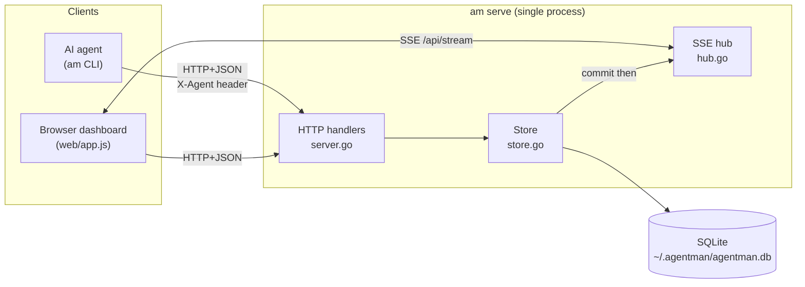

# System Map

## High-Level Architecture

One Go binary, two roles selected by the first CLI argument:

- **`am serve`** → an HTTP server (net/http) that owns the SQLite database, serves a JSON API,
  streams Server-Sent Events, and serves an embedded web dashboard.
- **Any other verb** (`ls`, `claim`, `note`, …) → a thin HTTP **client** of that same API.

Data flow: **CLI/dashboard → HTTP+JSON API → SQLite (single writer) → `events` table → SSE
broadcast → dashboard**. Confirmed via `cmd/am/main.go`, `cmd/am/server.go`, `cmd/am/store.go`,
`cmd/am/hub.go`.

## Directory Map

| Path | Purpose | Notes |
|------|---------|-------|
| `cmd/am/` | The entire `main` package (server + CLI) | Flat package; ~11 `.go` files |
| `cmd/am/main.go` | Entry point; subcommand dispatch; `runServe` | `main()` + `runServe()` + `usage()` |
| `cmd/am/server.go` | HTTP handlers, routing, SSE endpoint, `go:embed web` | `Server`, `Handler()`, `handle*` |
| `cmd/am/hub.go` | SSE subscriber hub (broadcast/fan-out) | `Hub`, `subscriber` |
| `cmd/am/store.go` | All SQLite access; types; atomic claim; events | `Store` + domain structs |
| `cmd/am/db.go` | `am db export`/`import`/`prune` (offline snapshot/restore/retention) | `cmdDB`, `exportDB`, `importDB`, `pruneEvents` |
| `cmd/am/schema.sql` | DB schema (embedded) | `meta/categories/projects/tasks/task_deps/task_labels/task_meta/tokens/comments/events` |
| `cmd/am/client.go` | CLI HTTP client; HTTP-status → exit-code mapping | `Client`, `doOrFail`, `exitCodeFor` |
| `cmd/am/cli.go` | CLI verb parsing + terse/JSON formatters | `cmd*`, `parse`, `fail` |
| `cmd/am/wait.go` | `am wait` (SSE-driven blocking waits, exit 7 on timeout) | `cmdWait`, `waiter`, `readSSEFrame` |
| `cmd/am/identity.go` | Per-directory agent identity + scope + token (`am init`/`am whoami`) | `resolveIdentity`, `resolveAgent`, `resolveScope`, `resolveToken`, `identityRecord` (`{agent,scope,token}`), `identityFile` |
| `cmd/am/version.go` | Version reporting (`am version`) | `version()`, `injectedVersion` (ldflags) |
| `cmd/am/update.go` | `am update` + startup update check | `cmdUpdate`, `checkForUpdate` |
| `cmd/am/*_test.go` | Tests: `update/store/server/migrate/db/cli/sse/hub/identity/wait/web_test` | claim race, HTTP guards, migrations, deletes, CLI/exit codes, SSE replay + category scope, hub fan-out, identity, waits/timeouts, XSS guard |
| `.github/workflows/ci.yml` | CI: build/vet/gofmt/test(-race)/JS-check/govulncheck on push + PR | — |
| `cmd/am/web/` | Embedded dashboard: `index.html`, `app.css`, `app.js` | Vanilla, no build step |
| `.github/workflows/ci.yml` | GitHub Actions CI — build/vet/gofmt/test(-race)/JS-syntax/govulncheck | Runs on push to `main` and on PRs |
| `docs/agent-integration.md` | How to wire agents (Claude Code) to the board | User docs |
| `README.md`, `LICENSE` | User guide; MIT license | — |
| `architecture/` | This documentation | — |

Unknown/absent: no `internal/`, `pkg/`, `Makefile`, `Dockerfile`, or `.goreleaser*`.

## Entry Points

- **Process entry:** `cmd/am/main.go` `func main()`. It reads `os.Args[1]` and dispatches.
  Local-only verbs (`init`, `whoami`, `version`, `update`, `db`) run without a server — `db`
  dispatches before the `Client` is built, operating directly on the SQLite file (`export`,
  `import`, and `prune` all refuse while a server is running); everything else
  constructs a `Client` (`NewClient()`); `serve` calls `runServe()`.
- **Server entry:** `runServe()` opens the store, builds `Server` (`NewServer`), sets the proposals
  carve-out project from `--proposals CAT/PROJ` / `AGENTMAN_PROPOSALS` (default `meta/proposals`;
  both segments required or startup `fail(1)`), optionally enables request logging (`--log` flag or
  `AGENTMAN_LOG` env var, any non-empty value; use `AGENTMAN_LOG=1`), and runs
  `http.Server{Addr: "127.0.0.1:"+port}`.
- **HTTP route table:** `Server.Handler()` in `cmd/am/server.go` (see Major Modules).

## Runtime Flow

**Agent write (e.g. `am claim 13`):**
`cmd/am/cli.go cmdClaim` → `Client.do` (HTTP POST `/api/tasks/13/claim`, `X-Agent` +
`X-Agent-Scope` headers when set) → `server.go handleClaim` → **scope pre-check** (`scopeOf(r)` then
`checkTaskMut`; out of scope → `403 out_of_scope` → CLI exit 8) → `store.go ClaimTask` (atomic
`UPDATE … RETURNING`, inserts an `events` row in the same tx) → on commit `Hub.Broadcast(event)` →
every SSE subscriber (open dashboards) receives it → exit code mapped from HTTP status via
`client.go exitCodeFor` (the single source, used by `doOrFail` and the bulk `status`/`assign` loop).

**Scope flow (Phase Q + Phase S tokens):** the CLI resolves a scope from the identity file or
`AGENTMAN_SCOPE` (`resolveScope`) and a token from the file or `AGENTMAN_TOKEN` (`resolveToken`).
**When a token is present the CLI sends `Authorization: Bearer <token>` and STOPS sending
`X-Agent-Scope`** (`client.go do()`); otherwise it sends the scope header. On the server,
`(s *Server) scopeOf(r)` is the **sole** reader of request scope: a bearer token WINS — it resolves
to the token's server-bound scope (`store.ResolveToken`) and ignores any header; an invalid/revoked
token → `ErrInvalidToken` → `401 unauthorized` → CLI exit 9 (never a silent fallthrough). With no
token the `X-Agent-Scope` header is the scope. Each handler then runs a `check*`/`narrowScope` helper
before touching the store. `am next` merges the scope into the `NextFilter` *inside* the atomic
pick+claim. Token mint/revoke is unscoped-only (`tokenAdminGuard`) and emits **no event**; denials
are logged (`denyScope`) and never broadcast.

**Human action on the dashboard:** identical path — the browser calls the same JSON API; its
own SSE connection then receives the broadcast (`cmd/am/web/app.js`).

**Dashboard view flow (Phase R):** the URL hash selects the view. On load / `hashchange`,
`route()` → `applyView` loads the right data (`#/` → `GET /api/categories` → overview cards;
`#/all`/`#/cat/<slug>` → board + feed) and **re-opens** `GET /api/stream` with the view's scope
(`?category=` for a category board, `?project=` for a single selected project, unfiltered for All/
overview). The dashboard sends **no `X-Agent-Scope`** — category view is a query-param lens, not an
identity scope.

## Major Modules

- **HTTP API + routing** — `cmd/am/server.go` `Handler()`. The middleware chain is
  `securityHeaders(hostGuard(csrfGuard(mux)))`. When request logging is enabled (`--log` /
  `AGENTMAN_LOG`), `requestLogger` wraps the entire chain outermost (so guard 403s are also
  logged); it captures the status code via `statusRecorder` (which also proxies `http.Flusher`
  to keep SSE working) and logs `METHOD PATH STATUS LATENCY ACTOR` per request.
  Routes: `GET/POST /api/categories` (`GET …?archived=true` includes archived; `GET` returns a
  `CategoryStat` per category — `Category` + computed `counts` over non-archived projects +
  `active_agents` in a 30-min window, for the dashboard's category-home view),
  `POST /api/categories/{slug}/archive`, `POST /api/categories/{slug}/unarchive`,
  `GET/POST /api/projects` (`GET …?archived=true` includes archived; `?category=<slug>` scopes;
  POST takes optional `category`, defaulting to `general`),
  `PATCH /api/projects/{slug}` (slug/name/vault binding; `uid`/category never patchable),
  `POST /api/projects/{slug}/archive`, `POST /api/projects/{slug}/unarchive`,
  `DELETE /api/projects/{slug}` (hard-delete + cascade),
  `GET/POST /api/tasks` (`?category=<slug>` scopes by category; `?ready=true` / `?blocked=true`
  filter by prereq state; `?stale=<dur>`
  filters to assigned, not-done tasks with no activity for ≥ dur; `?q=<text>` substring search on
  title OR body; `?label=<l>` exact label match; `?meta_key=<k>` meta-key presence match; POST
  takes optional `meta` key=value pairs),
  `GET/PATCH /api/tasks/{id}` (GET returns `depends_on`/`blocks` + `meta`; PATCH takes optional
  `meta` — empty value removes a key; meta-only patches don't bump `updated_at`),
  `DELETE /api/tasks/{id}` (hard-delete + cascade to comments + dep edges + meta),
  `POST /api/tasks/next` (atomic pick+claim of the best ready task, optional
  `{"project"?,"category"?,"meta_key"?}` scope; 404 if none),
  `POST /api/tasks/{id}/claim` (body `{"steal_stale":"<dur>"}` = stale-claim takeover, 409
  `not_stale` if still fresh), `POST /api/tasks/{id}/comments`,
  `DELETE /api/tasks/{id}/comments/{cid}`,
  `POST /api/tasks/{id}/deps` (add prerequisite edge),
  `DELETE /api/tasks/{id}/deps/{depId}` (remove prerequisite edge),
  `POST /api/tasks/{id}/labels` (attach a label; idempotent),
  `DELETE /api/tasks/{id}/labels/{label}` (detach a label; idempotent),
  `GET /api/projects/{slug}/graph` (read-only DAG: all tasks as nodes + dep edges; 404 on missing
  project; no events emitted),
  `GET /api/events` (`?since=` ascending / `?tail=` newest-first / `?before=` backward cursor;
  `?project=` and/or `?category=` scope — a `?category=` lens shows the category's projects' events
  and excludes category-level NULL-project events; unknown category → 404),
  `GET /api/stream` (SSE; same `?project=`/`?category=` scoping of the live stream + gap-replay,
  resolved once at Subscribe; `project.created` delivered regardless; unknown category ignored
  silently),
  `POST /api/tokens` (mint a scope-bound bearer token — `201` with the plaintext once),
  `GET /api/tokens` (list — never plaintext/hash), `POST /api/tokens/{id}/revoke` (revoke) — all
  three **require an unscoped caller** (`tokenAdminGuard`; Phase S), and `/` → `http.FileServer` over
  `go:embed web`.
  All three DELETE routes return `200 {"status":"deleted"}`; `ErrNotFound` → 404.
  (Uses Go 1.22+ method+pattern ServeMux, e.g. `"GET /api/tasks/{id}"`.)
- **SSE hub** — `cmd/am/hub.go`: best-effort fan-out; buffered per-subscriber channels; a
  `project.created` event reaches all subscribers regardless of filter. A subscription's scope is a
  `subFilter{projectID, categoryID, projectIDs}` (Phase R); a `?category=` stream resolves the
  category's project-id set **once** at Subscribe (`ProjectIDsInCategory`) so `Broadcast` is a pure
  in-memory membership check (no per-event DB hits) — cross-category and category-level
  (NULL-project) events are dropped.
- **Data layer** — `cmd/am/store.go`: opens SQLite with `SetMaxOpenConns(1)` (single writer),
  WAL via DSN pragmas; refuses a DB whose `schema_version` is newer than the binary supports
  (Phase O); all queries parameterized; atomic claim (+ the stale-claim takeover
  `StealStaleClaim` and the pick+claim `NextTask`, the same conditional-UPDATE trick); event
  insertion helper. Phase R adds `ListCategoriesWithStats` (counts + active-agents rollups for the
  dashboard's category home), `ProjectIDsInCategory` (the hub's Subscribe-time set), and a
  `category` parameter on `ListEvents`/`ListEventsBefore`/`RecentEvents` (the `?category=` feed
  lens, excluding NULL-project events).
  Hard-delete methods: `DeleteTask`, `DeleteComment`, `DeleteProject` (each inserts `*.deleted`
  event in the same tx before the DELETE, then commits; cascade via FK).
- **CLI** — `cmd/am/cli.go` + `cmd/am/client.go`: verb parsing, terse output, exit-code mapping.
  Includes `project archive`/`project unarchive <slug>` and `projects --all` (lists archived,
  marked `(archived)`); `db export`/`db import`/`db prune` are handled offline in `cmd/am/db.go`.
  Categories (Phase O): `am categories [--all]`, `am category new <slug> [name]`,
  `am category archive|unarchive <slug>`; `am project new <slug> [name] -c <category>` (category
  required — flag or `AGENTMAN_CATEGORY`); `am project edit <slug> [--slug NEW] [--name N]
  [--vault-id X] [--vault-path Y]` (vault binding; explicit-empty clears); `-c <cat>` scopes
  `am ls`, `am next`, and `am wait --ready` (`am show <id> -c` still means `--comments` — `main.go
  rewriteShowComments` rewrites it for `show` only).
  Scoped identity (Phase Q): `am init <tasktype> [-c CAT [-p PROJ]]` records a scope in the identity
  file (JSON when scoped, legacy bare-id plain text when not); `am whoami` prints a `scope:` line
  when scoped; the resolved scope (`AGENTMAN_SCOPE` overrides the file) rides as `X-Agent-Scope` on
  every request and yields exit 8 on any `403 out_of_scope`.
  Scope tokens (Phase S): `am token new --scope <cat[/proj]>` mints a scope-bound bearer token (the
  human runs this, unscoped), prints the plaintext on stdout line 1 and **merges** it into the
  identity file's `token` field (preserving agent/scope); `am token ls [--json]` lists tokens
  (id/scope/created/[revoked], never the plaintext/hash); `am token revoke <id>` revokes one. The CLI
  then sends `Authorization: Bearer <token>` (and drops `X-Agent-Scope`) when a token is present
  (file or `AGENTMAN_TOKEN`); `am whoami` adds a `token: set` line; an invalid/revoked token → exit 9
  (`cmdToken`/`storeToken` in `cli.go`; `resolveToken` in `identity.go`).
  Hard-delete verbs: `am rm <id>` (silent success, exit 3 if not found); `am project rm <slug> --yes`
  (requires `--yes`; cascade-deletes project + all tasks/comments). `am db prune (--before <date> |
  --keep <N>) [--yes]` — offline events-only retention.
  Dependency verbs: `am dep add <id> <prereq…>` (add one or more prerequisite edges),
  `am dep rm <id> <prereq>` (remove an edge). `am ls --ready` lists todo tasks with no open
  prereqs; `am ls --blocked` lists tasks with ≥1 open prereq. `am ls` rows show a `[blk:N]` marker
  (N open prereqs) or `[ready]` (has prereqs, all done). `am show <id>` prints `depends on:` and
  `blocks:` lines when present. Claiming a blocked task exits 4 with a message showing the open
  prereq ids. Stale-claim recovery: `am ls --stale <dur>` lists assigned, not-done tasks with no
  activity for ≥ dur (Go duration syntax, e.g. `30m`, `48h`); `am claim <id> --steal-stale <dur>`
  atomically takes over a stale claim (exit 4 with `not stale yet` if the claim is still fresh).
  Agent work loop: `am next [-p P] [-c CAT] [--meta KEY]` atomically picks + claims the best
  ready task via `POST /api/tasks/next` (prints the claimed id; exit 3 if none);
  `am wait <id> --done` /
  `am wait --ready [-p P] [-c CAT] [--meta KEY]` block until the condition holds (SSE-driven, in
  `cmd/am/wait.go`;
  exit 7 on timeout, default 10m); `am status <id...> <st>` and `am assign <id...> <who>` accept
  multiple ids (client-side loop, one event per task; exit = first failure's code).
  Findability: `am ls --grep TEXT` (substring search over title + body, ASCII-case-insensitive)
  and `am ls --label L` (or `-l L`; exact label match) map to `?q=` / `?label=` on
  `GET /api/tasks`; `am label <id> [+add ...] [-remove ...]` adds/removes labels (bare token =
  add; lowercase 1-50 chars of `a-z 0-9 . _ -`), and bare `am label <id>` prints the task's
  labels on one line.
  Task metadata (Phase P): repeatable `--meta k=v` on `am new`/`am edit` (all pairs ride in one
  request; `--meta k=` on `edit` removes the key; tokens split at the first `=`); a single
  `--meta KEY` presence filter on `am ls`/`am next`/`am wait --ready` (two keys or `key=value`
  → exit 5; `--done --meta` → usage error); `am show <id>` prints a sorted `meta: k=v …` line
  when meta exists.
- **Dashboard** — `cmd/am/web/app.js`: vanilla SPA; SSE consumer; board/modal/feed rendering.
  **Hash routing** (Phase R): `route()` maps `#/` → category-home overview (the landing view),
  `#/all` → cross-category board, `#/cat/<slug>` → a single category's board. The overview
  (`loadOverview`/`renderOverview`/`catCard`/`allCard`, in `#overview`) renders a card per category
  with count chips + active-agent avatars (from `GET /api/categories`'s `CategoryStat`) and an
  "All" card; cards drill in via the hash. A header `#breadcrumb` ("← Categories" + view name)
  shows on the board views. A category board scopes its tabs (`projectsInView`), board, feed, and
  stream by `?category=` via `viewParams()`; the stream is re-opened on every view change, and the
  overview's counts refresh debounced on `task.*`/`project.*`/`category.*` events.
  Includes a `⋯` "Manage" button in the tab bar that opens a modal (`openManage`, alias
  `openManageProjects`) with a **Categories** section (`renderManageCategories` — every category incl.
  archived via `GET /api/categories?archived=true`, with Archive/Unarchive toggles) and a
  **Projects** section (`renderManageList` — all projects active + archived via
  `GET /api/projects?archived=true`), each project row carrying an **Edit** button
  (`openEditProject` — rename + vault binding via `PATCH /api/projects/{slug}`), Archive/Unarchive
  buttons, and a **Delete project** button (inline two-step confirm, calls
  `DELETE /api/projects/{slug}`). The **＋** new-project modal has a required category `<select>` and
  POSTs `category` in the body; the overview's dashed **＋ New category** add-card POSTs
  `/api/categories`. A header **Filter** popover (`#filterBtn`/`#filterPanel`) folds
  ready/blocked/stale/assignee/meta_key filters into `loadBoard()`'s query string.
  The task modal has a **Delete task** button (inline two-step) and a **Release** button (one PATCH of
  `{assignee:"", status:"todo"}`, shown when the task is claimed or not in todo);
  each comment has a **× delete** button (inline two-step; `DELETE /api/tasks/{id}/comments/{cid}`).
  All confirms use the `el()` helper, no native `confirm()`/`prompt()`. `onEvent` handles
  `task.deleted` (remove card + close modal), `comment.deleted` (refresh modal),
  `project.deleted` (drop from selection + reload), and `task.dep_added`/`task.dep_removed`
  (refresh the open modal for either side of the edge). The activity feed hides archived projects'
  events (no `project=` filter → `ListEvents`/`RecentEvents` exclude events whose project has a
  non-NULL `archived_at`). Task creation into an archived project is rejected at the store layer
  (`CreateTask` → `ErrProjectArchived` → HTTP 400).
  Board cards show a **🔒 Blocked** tag (`nopen > 0`) or **✓ Ready** tag (`nprereq > 0 && nopen == 0`),
  and an amber **⏳ stale** chip on `doing` cards with an assignee and no activity for 30+ minutes.
  The feed renders `task.reclaimed` (stale-claim takeover) as "X reclaimed #N from Y", and the
  project-less `category.created/archived/unarchived` events with explicit cases (the default
  branch would render a literal "null" ref); the project strip reloads on
  `category.archived`/`category.unarchived` so the archive cascade shows live.
  The task modal has a **Dependencies** section: "Depends on" chips with a ✕ remove button, an
  "Add prerequisite…" dropdown of same-project tasks, and a read-only "Blocks" list. A hard-block
  409 surfaces the blocking prereq ids and reverts the UI. An editable **Meta** section after
  Labels lists the task's key=value pairs (sorted) with a ✕ to remove each and an add-row to create
  one (`patchMeta` → `PATCH /api/tasks/{id}` `{meta:{…}}`, empty value deletes; ADR-031), and
  `task.patched` feed lines append `(meta: k1, k2)` when the event delta contains meta.
  A **"Graph"** button in the header (and the `g` keyboard shortcut) opens a full-screen
  **dependency-graph overlay**: a layered SVG DAG of all tasks in a project, with pan/zoom,
  transitive-path highlighting on click, a right detail panel, a legend, and live refresh from SSE
  (via `GET /api/projects/{slug}/graph`; `svg()` helper + `createElementNS`; no library).

## External Dependencies

- **`modernc.org/sqlite` v1.51.0** — pure-Go (cgo-free) SQLite driver (`go.mod`). Everything
  else in `go.mod` is its indirect deps (e.g. `modernc.org/libc`, `golang.org/x/sys`).
- **Go module proxy** (`proxy.golang.org`) — queried at `am serve` startup for the latest version
  (`cmd/am/update.go checkForUpdate`). Network-optional.
- **Standard library only** otherwise: `net/http`, `database/sql`, `encoding/json`, `embed`,
  `os/exec` (for `am update`), `crypto/sha1` (identity file key), `crypto/rand` (uids + token
  plaintext) + `crypto/sha256` (token hashing, Phase S).

## Data Stores

- **SQLite file** — default `~/.agentman/agentman.db` (`cmd/am/main.go defaultDBPath`, overridable
  via `--db` / `AGENTMAN_DB`). WAL mode (`*.db-wal`, `*.db-shm` sidecars).
- **Identity files** — `~/.agentman/agents/<sha1(cwd)>` (`cmd/am/identity.go`), one per working dir.
  JSON `{agent, scope?, token?}` when scoped/tokenized; the optional `token` (Phase S) is the agent's
  plaintext bearer credential (scope-sensitive — a reader of the file can act as that scope).

## Dependency Direction

`main.go` → {`server.go` (serve) | `client.go`+`cli.go`+`wait.go` (CLI)}. `server.go` → `store.go` +
`hub.go`. `store.go` → `schema.sql` (embedded) + `modernc.org/sqlite`. `cli.go`/`client.go`/`wait.go` →
the HTTP API (process boundary), not `store.go` directly. The browser (`web/app.js`) depends only
on the JSON API. No circular dependencies; it is a flat `main` package, so module boundaries are
by convention, not by Go package walls (see `engineering-conventions.md`).

## Diagram

## Unknowns

- No deployment/infra files exist, so the **intended runtime topology beyond "one local
  process"** is unspecified (Unknown).
- Whether multiple `am serve` processes are ever expected to share one DB file: the single-writer
  design suggests **no**, but it is not documented (Inference, Confidence: Medium).
